# 🔐 Blockchain Security Developer Roadmap

*Your comprehensive guide to becoming a Blockchain Security Expert*

---

## 🎯 Overview

This roadmap provides a structured path to becoming a proficient Blockchain Security Developer. Whether you're starting from scratch or looking to specialize in blockchain security, this guide will take you through the essential skills, tools, and knowledge areas.

```mermaid
graph TD
    A[🎯 Start Here] --> B[📚 Foundation Knowledge]
    B --> C[🔧 Core Technologies]
    C --> D[🛡️ Security Fundamentals]
    D --> E[⚡ Smart Contract Security]
    E --> F[🔍 Auditing & Testing]
    F --> G[🚀 Advanced Topics]
    G --> H[💼 Professional Development]
    
    style A fill:#e1f5fe
    style B fill:#f3e5f5
    style C fill:#e8f5e8
    style D fill:#fff3e0
    style E fill:#fce4ec
    style F fill:#e0f2f1
    style G fill:#f1f8e9
    style H fill:#e8eaf6
```

---

## 🗺️ Learning Path

### Phase 1: Foundation Knowledge (2-3 months)

#### 📚 **Prerequisites**
- [ ] **Programming Fundamentals**
  - Variables, functions, loops, conditionals
  - Object-oriented programming concepts
  - Data structures and algorithms

- [ ] **Mathematics & Cryptography Basics**
  - Number theory fundamentals
  - Hash functions
  - Digital signatures
  - Public-key cryptography

#### 🔤 **Programming Languages**

| Language | Priority | Use Case | Resources |
|----------|----------|----------|-----------|
| **Solidity** | 🔥 High | Smart contracts (Ethereum) | [Solidity Docs](https://docs.soliditylang.org/) |
| **JavaScript/TypeScript** | 🔥 High | DApp development, testing | [MDN Web Docs](https://developer.mozilla.org/) |
| **Python** | 🟡 Medium | Security tools, analysis | [Python.org](https://python.org) |
| **Rust** | 🟡 Medium | Solana, Substrate development | [Rust Book](https://doc.rust-lang.org/book/) |
| **Go** | 🟢 Low | Blockchain infrastructure | [Go Documentation](https://golang.org/doc/) |

---

### Phase 2: Core Technologies (3-4 months)

#### 🔗 **Blockchain Fundamentals**

**Core Concepts to Master:**
- [ ] How blocks are structured and linked
- [ ] Proof of Work vs Proof of Stake
- [ ] Transaction lifecycle
- [ ] Mining and validation processes
- [ ] Network topology and communication

#### ⚡ **Smart Contract Platforms**

| Platform | Focus Area | Key Features |
|----------|------------|--------------|
| **Ethereum** | General purpose | EVM, Solidity, Large ecosystem |
| **Binance Smart Chain** | DeFi focused | EVM compatible, Lower fees |
| **Polygon** | Scaling solution | Layer 2, Fast transactions |
| **Solana** | High performance | Rust-based, High throughput |
| **Cardano** | Academic approach | Haskell, Formal verification |

---

### Phase 3: Security Fundamentals (2-3 months)

#### 🛡️ **Cybersecurity Principles**

**Essential Security Concepts:**
- [ ] **Cryptographic Principles**
  - Symmetric vs Asymmetric encryption
  - Hash functions and their properties
  - Digital signatures and verification
  - Key management practices

- [ ] **Network Security**
  - SSL/TLS protocols
  - VPNs and secure communication
  - Firewall configurations
  - DDoS protection mechanisms

---

### Phase 4: Smart Contract Security (4-5 months)

#### 🔍 **Common Vulnerabilities**

| Vulnerability | Description | Impact Level | Prevention |
|---------------|-------------|--------------|------------|
| **Reentrancy** | Recursive calls before state updates | 🔴 Critical | Checks-Effects-Interactions pattern |
| **Integer Overflow/Underflow** | Arithmetic operations beyond limits | 🔴 Critical | SafeMath libraries |
| **Access Control** | Unauthorized function execution | 🔴 Critical | Proper modifier implementation |
| **Front-running** | Transaction order manipulation | 🟡 Medium | Commit-reveal schemes |
| **Flash Loan Attacks** | Exploiting temporary liquidity | 🔴 Critical | Price oracle validation |

#### 🧪 **Testing Frameworks**

---

### Phase 5: Auditing & Testing (3-4 months)

#### 🔬 **Security Analysis Tools**

**Static Analysis Tools:**
- [ ] **Slither** - Solidity static analysis framework
- [ ] **Mythril** - Security analysis tool for Ethereum
- [ ] **Securify** - Smart contract scanner
- [ ] **SmartCheck** - Static analysis of Solidity

**Dynamic Analysis Tools:**
- [ ] **Echidna** - Property-based fuzzer
- [ ] **Manticore** - Symbolic execution tool
- [ ] **Scribble** - Runtime verification

#### 📋 **Audit Methodology**

---

### Phase 6: Advanced Topics (4-6 months)

#### 🚀 **Specialized Areas**

**DeFi Security:**
- [ ] Automated Market Makers (AMM) security
- [ ] Flash loan attack vectors
- [ ] Oracle manipulation
- [ ] Yield farming risks
- [ ] Cross-chain bridge security

**NFT Security:**
- [ ] Metadata security
- [ ] Ownership verification
- [ ] Marketplace vulnerabilities
- [ ] Royalty enforcement

**Layer 2 Solutions:**
- [ ] State channel security
- [ ] Rollup mechanisms
- [ ] Plasma security models
- [ ] Sidechain considerations

#### 🔧 **Advanced Tools & Techniques**

| Category | Tools | Purpose |
|----------|-------|---------|
| **Formal Verification** | Dafny, K Framework, TLA+ | Mathematical proof of correctness |
| **Symbolic Execution** | SAGE, KLEE, Manticore | Explore execution paths |
| **Fuzzing** | AFL, libFuzzer, Echidna | Automated input generation |
| **Runtime Monitoring** | OpenZeppelin Defender | Real-time threat detection |

---

### Phase 7: Professional Development (Ongoing)

#### 💼 **Career Paths**

#### 📜 **Certifications & Credentials**

- [ ] **Certified Ethereum Developer (CED)**
- [ ] **Blockchain Security Professional (BSP)**
- [ ] **Smart Contract Auditor Certification**
- [ ] **DeFi Security Specialist**

---

## 🛠️ Essential Tools & Resources

### 🔧 **Development Environment**

| Tool | Category | Description |
|------|----------|-------------|
| **Hardhat** | Framework | Ethereum development environment |
| **Truffle** | Framework | Smart contract development suite |
| **Remix** | IDE | Browser-based Solidity IDE |
| **Ganache** | Blockchain | Personal Ethereum blockchain |
| **MetaMask** | Wallet | Browser extension wallet |

### 📚 **Learning Resources**

**Books:**
- [ ] "Mastering Ethereum" by Andreas Antonopoulos
- [ ] "Smart Contract Security Field Guide" by SecureSet Academy
- [ ] "Blockchain Security" by Shouhuai Xu

**Online Courses:**
- [ ] ConsenSys Academy Blockchain Developer Program
- [ ] ChainShot Ethereum Developer Bootcamp
- [ ] Secureum Smart Contract Security

**Practice Platforms:**
- [ ] **Ethernaut** - Smart contract hacking game
- [ ] **Damn Vulnerable DeFi** - DeFi security challenges
- [ ] **CryptoZombies** - Learn Solidity through games

---

## 📈 Progress Tracking

### 🎯 **Milestones Checklist**

#### Foundation Level (Months 1-3)
- [ ] Complete basic programming concepts
- [ ] Understand blockchain fundamentals
- [ ] Write first smart contract
- [ ] Set up development environment

#### Intermediate Level (Months 4-8)
- [ ] Deploy contracts to testnet
- [ ] Identify common vulnerabilities
- [ ] Complete security analysis course
- [ ] Audit first smart contract

#### Advanced Level (Months 9-12)
- [ ] Contribute to open-source security tools
- [ ] Complete professional audit
- [ ] Publish security research
- [ ] Obtain relevant certification

#### Expert Level (Year 2+)
- [ ] Lead security audits
- [ ] Speak at conferences
- [ ] Develop new security tools
- [ ] Mentor other developers

---

## 🌟 Project Ideas

### 🔰 **Beginner Projects**
1. **Simple Token Contract** - ERC-20 with basic security features
2. **Voting System** - Secure voting mechanism
3. **Multi-sig Wallet** - Basic multi-signature implementation

### 🔄 **Intermediate Projects**
1. **DeFi Yield Farm** - Secure staking mechanism
2. **NFT Marketplace** - Complete marketplace with security features
3. **DAO Implementation** - Decentralized governance system

### 🚀 **Advanced Projects**
1. **Security Analysis Tool** - Custom vulnerability scanner
2. **Cross-chain Bridge** - Secure asset transfer protocol
3. **Zero-Knowledge Proof System** - Privacy-preserving authentication

---

## 🤝 Community & Networking

### 🌐 **Communities to Join**

| Platform | Community | Focus |
|----------|-----------|-------|
| **Discord** | Secureum, OpenZeppelin | Security discussions |
| **Telegram** | Smart Contract Security | Real-time updates |
| **Reddit** | r/ethdev, r/ethereum | Development discussions |
| **Twitter** | #SmartContractSecurity | Industry news |

### 🎤 **Conferences & Events**
- [ ] **DEF CON** - Hacker conference with blockchain track
- [ ] **Black Hat** - Information security conference
- [ ] **Devcon** - Ethereum developer conference
- [ ] **ETHGlobal Hackathons** - Global Ethereum events

---

## 💡 Tips for Success

### 🎯 **Best Practices**

1. **Stay Updated** 📰
   - Follow security researchers on Twitter
   - Subscribe to blockchain security newsletters
   - Join security-focused Discord servers

2. **Practice Regularly** 💪
   - Solve Ethernaut challenges weekly
   - Review recent security incidents
   - Participate in bug bounty programs

3. **Build a Portfolio** 📁
   - Document your audit findings
   - Create open-source security tools
   - Write technical blog posts

4. **Network Actively** 🤝
   - Attend blockchain meetups
   - Participate in online discussions
   - Collaborate on security research

---

## 🚨 Security Mindset

Remember: **Security is not a destination, but a journey.** Always assume that:

- 🔍 Every contract has vulnerabilities until proven otherwise
- 🧪 Testing can show the presence of bugs, never their absence
- 🔄 The threat landscape constantly evolves
- 🤝 Collaboration and peer review are essential

---

