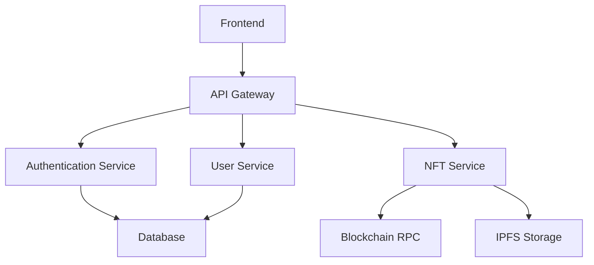

# 🎨 NFT Marketplace Technology Stack Guide

<div align="center">
  
  
  
  
  
</div>

<p align="center">
  <strong>A comprehensive guide to building modern NFT marketplaces</strong>
</p>

<p align="center">
  <a href="#-quick-start">Quick Start</a> •
  <a href="#-tech-stack">Tech Stack</a> •
  <a href="#-smart-contracts">Smart Contracts</a> •
  <a href="#-deployment">Deployment</a> •
  <a href="#-contributing">Contributing</a>
</p>

---

## 🚀 Quick Start

> Get up and running with our NFT marketplace technology stack in minutes!

### Prerequisites

- Node.js 16+ and npm/yarn
- MetaMask wallet
- Basic knowledge of React and Solidity
- Understanding of blockchain concepts

### Installation

```bash
# Clone the repository
git clone https://github.com/your-org/nft-marketplace.git

# Install dependencies
cd nft-marketplace
npm install

# Set up environment variables
cp .env.example .env
```

---

## 📚 Table of Contents

- [🏗️ Blockchain & Smart Contracts](#️-blockchain--smart-contracts)
- [⚡ Frontend Technologies](#-frontend-technologies)
- [🔧 Backend Infrastructure](#-backend-infrastructure)
- [💾 Storage Solutions](#-storage-solutions)
- [🛡️ Security & Testing](#️-security--testing)
- [🔨 Development Tools](#-development-tools)
- [📜 Smart Contract Details](#-smart-contract-details)
- [🔌 Integration Libraries](#-integration-libraries)
- [⚡ Performance & Scalability](#-performance--scalability)

---

## 🏗️ Blockchain & Smart Contracts

### Supported Blockchain Networks

| Network | Type | Key Features |
|---------|------|--------------|
| **Ethereum** | L1 | ERC-721/1155 standards, established ecosystem |
| **Polygon** | L2 | Lower gas fees, fast transactions |
| **BSC** | Alternative | Low fees, Binance ecosystem |
| **Solana** | High-performance | Ultra-fast, low costs |
| **Avalanche** | L1 | Fast finality, subnet support |
| **Flow** | NFT-focused | Built for digital collectibles |

### Smart Contract Standards

```solidity
// ERC-721 Standard (Single NFT)
interface IERC721 {
    function ownerOf(uint256 tokenId) external view returns (address);
    function safeTransferFrom(address from, address to, uint256 tokenId) external;
}

// ERC-1155 Standard (Multi-token)
interface IERC1155 {
    function balanceOf(address account, uint256 id) external view returns (uint256);
    function safeTransferFrom(address from, address to, uint256 id, uint256 amount, bytes calldata data) external;
}

// ERC-2981 Standard (Royalties)
interface IERC2981 {
    function royaltyInfo(uint256 tokenId, uint256 salePrice) external view 
        returns (address receiver, uint256 royaltyAmount);
}
```

### Development Stack

- 🔥 **Solidity** - Smart contract language
- ⚡ **Hardhat** - Development environment
- 🛡️ **OpenZeppelin** - Security-audited libraries
- 🔗 **Chainlink** - Oracle services

---

## ⚡ Frontend Technologies

### Core Technologies

```jsx
// Example React component
import { useContract, useContractRead } from 'wagmi'
import { NFT_MARKETPLACE_ABI } from './constants'

function NFTListing({ tokenId }) {
  const { data: listing } = useContractRead({
    address: MARKETPLACE_ADDRESS,
    abi: NFT_MARKETPLACE_ABI,
    functionName: 'getListing',
    args: [tokenId],
  })

  return (
    <div className="bg-white rounded-lg shadow-md p-4">
      {/* NFT listing content */}
    </div>
  )
}
```

### Tech Stack Overview

<table>
  <tr>
    <th>Category</th>
    <th>Technology</th>
    <th>Description</th>
  </tr>
  <tr>
    <td><strong>Web3 Integration</strong></td>
    <td>Wagmi, Ethers.js, Web3.js</td>
    <td>Blockchain interaction libraries</td>
  </tr>
  <tr>
    <td><strong>Frontend Framework</strong></td>
    <td>Next.js, React, TypeScript</td>
    <td>Modern web development stack</td>
  </tr>
  <tr>
    <td><strong>UI Libraries</strong></td>
    <td>Tailwind CSS, Chakra UI, Framer Motion</td>
    <td>Styling and animations</td>
  </tr>
  <tr>
    <td><strong>State Management</strong></td>
    <td>Redux Toolkit, Zustand, Recoil</td>
    <td>Application state handling</td>
  </tr>
</table>

---

## 🔧 Backend Infrastructure

### Server Architecture



### Technology Stack

- **Node.js / Express** - Backend runtime
- **PostgreSQL** - User & transaction data
- **Redis** - Caching & session management
- **MongoDB** - NFT metadata storage
- **GraphQL / REST** - API architecture

---

## 💾 Storage Solutions

### Decentralized Storage Options

| Storage | Pros | Cons | Use Case |
|---------|------|------|----------|
| **IPFS** | Distributed, content-addressed | Requires pinning | NFT metadata, images |
| **Arweave** | Permanent storage | Higher costs | Permanent collections |
| **Filecoin** | Decentralized marketplace | Complex integration | Large files |

### Implementation Example

```javascript
// IPFS Integration with Pinata
import { PinataSDK } from "pinata-web3";

const pinata = new PinataSDK({
  pinataJwt: process.env.PINATA_JWT!,
  pinataGateway: "example-gateway.mypinata.cloud",
});

async function uploadNFTMetadata(metadata) {
  const upload = await pinata.upload.json(metadata)
  return `ipfs://${upload.IpfsHash}`
}
```

---

## 🛡️ Security & Testing

### Security Checklist

- [ ] **Smart Contract Audits**
  - OpenZeppelin Defender
  - Certik Audit
  - Slither Analysis

- [ ] **Frontend Security**
  - Input validation
  - XSS prevention
  - CORS configuration

- [ ] **Backend Security**
  - Rate limiting
  - API authentication
  - SQL injection prevention

### Testing Strategy

```javascript
// Example smart contract test
describe("NFTMarketplace", function () {
  it("Should list an NFT for sale", async function () {
    const [owner, seller, buyer] = await ethers.getSigners();
    
    // Deploy contracts
    const NFT = await ethers.getContractFactory("NFTCollection");
    const nft = await NFT.deploy();
    
    const Marketplace = await ethers.getContractFactory("NFTMarketplace");
    const marketplace = await Marketplace.deploy();
    
    // Test listing functionality
    await nft.connect(seller).mint("ipfs://test-uri");
    await nft.connect(seller).approve(marketplace.address, 0);
    
    await expect(
      marketplace.connect(seller).listNFT(nft.address, 0, ethers.utils.parseEther("1"))
    ).to.emit(marketplace, "NFTListed");
  });
});
```

---

## 📜 Smart Contract Details

### Core Contract Architecture

```solidity
// Complete NFT Marketplace Contract
contract NFTMarketplace is ReentrancyGuard, Ownable, Pausable {
    using Counters for Counters.Counter;
    Counters.Counter private _listingIds;
    
    uint256 public marketplaceFee = 250; // 2.5%
    address public feeRecipient;
    
    struct Listing {
        uint256 listingId;
        address nftContract;
        uint256 tokenId;
        address seller;
        uint256 price;
        bool sold;
        bool cancelled;
    }
    
    mapping(uint256 => Listing) public listings;
    mapping(address => mapping(uint256 => uint256)) public nftToListing;
    
    event NFTListed(
        uint256 indexed listingId,
        address indexed nftContract,
        uint256 indexed tokenId,
        address seller,
        uint256 price
    );
    
    event NFTSold(
        uint256 indexed listingId,
        address indexed buyer,
        uint256 price,
        uint256 fee
    );
    
    constructor(address _feeRecipient) {
        feeRecipient = _feeRecipient;
    }
    
    function listNFT(
        address nftContract,
        uint256 tokenId,
        uint256 price
    ) external whenNotPaused {
        require(price > 0, "Price must be greater than 0");
        require(
            IERC721(nftContract).ownerOf(tokenId) == msg.sender,
            "Not the NFT owner"
        );
        require(
            IERC721(nftContract).isApprovedForAll(msg.sender, address(this)) ||
            IERC721(nftContract).getApproved(tokenId) == address(this),
            "Marketplace not approved"
        );
        
        _listingIds.increment();
        uint256 listingId = _listingIds.current();
        
        listings[listingId] = Listing({
            listingId: listingId,
            nftContract: nftContract,
            tokenId: tokenId,
            seller: msg.sender,
            price: price,
            sold: false,
            cancelled: false
        });
        
        nftToListing[nftContract][tokenId] = listingId;
        
        emit NFTListed(listingId, nftContract, tokenId, msg.sender, price);
    }
    
    function buyNFT(uint256 listingId) external payable nonReentrant whenNotPaused {
        Listing storage listing = listings[listingId];
        
        require(!listing.sold, "NFT already sold");
        require(!listing.cancelled, "Listing cancelled");
        require(msg.value >= listing.price, "Insufficient payment");
        
        uint256 fee = (listing.price * marketplaceFee) / 10000;
        uint256 sellerProceeds = listing.price - fee;
        
        listing.sold = true;
        
        // Transfer NFT
        IERC721(listing.nftContract).safeTransferFrom(
            listing.seller,
            msg.sender,
            listing.tokenId
        );
        
        // Transfer payments
        (bool successFee, ) = feeRecipient.call{value: fee}("");
        require(successFee, "Fee transfer failed");
        
        (bool successSeller, ) = listing.seller.call{value: sellerProceeds}("");
        require(successSeller, "Seller payment failed");
        
        // Handle royalties if supported
        if (IERC721(listing.nftContract).supportsInterface(0x2a55205a)) {
            (address royaltyReceiver, uint256 royaltyAmount) = 
                IERC2981(listing.nftContract).royaltyInfo(listing.tokenId, listing.price);
            
            if (royaltyAmount > 0 && royaltyReceiver != address(0)) {
                (bool successRoyalty, ) = royaltyReceiver.call{value: royaltyAmount}("");
                require(successRoyalty, "Royalty payment failed");
            }
        }
        
        emit NFTSold(listingId, msg.sender, listing.price, fee);
    }
    
    function cancelListing(uint256 listingId) external {
        Listing storage listing = listings[listingId];
        require(msg.sender == listing.seller || msg.sender == owner(), "Not authorized");
        require(!listing.sold, "Already sold");
        
        listing.cancelled = true;
        
        emit ListingCancelled(listingId);
    }
    
    // Admin functions
    function updateMarketplaceFee(uint256 newFee) external onlyOwner {
        require(newFee <= 1000, "Fee too high"); // Max 10%
        marketplaceFee = newFee;
    }
    
    function pause() external onlyOwner {
        _pause();
    }
    
    function unpause() external onlyOwner {
        _unpause();
    }
}

// Auction Contract
contract NFTAuction is ReentrancyGuard, Ownable {
    using Counters for Counters.Counter;
    Counters.Counter private _auctionIds;
    
    struct Auction {
        uint256 auctionId;
        address nftContract;
        uint256 tokenId;
        address seller;
        uint256 startingPrice;
        uint256 reservePrice;
        uint256 highestBid;
        address highestBidder;
        uint256 startTime;
        uint256 endTime;
        bool ended;
        bool cancelled;
    }
    
    mapping(uint256 => Auction) public auctions;
    mapping(uint256 => mapping(address => uint256)) public bids;
    
    uint256 public auctionFee = 250; // 2.5%
    uint256 public minBidIncrement = 100; // 1%
    
    event AuctionCreated(uint256 indexed auctionId, address indexed seller, uint256 startingPrice, uint256 endTime);
    event BidPlaced(uint256 indexed auctionId, address indexed bidder, uint256 amount);
    event AuctionEnded(uint256 indexed auctionId, address indexed winner, uint256 amount);
    
    function createAuction(
        address nftContract,
        uint256 tokenId,
        uint256 startingPrice,
        uint256 reservePrice,
        uint256 duration
    ) external returns (uint256) {
        require(IERC721(nftContract).ownerOf(tokenId) == msg.sender, "Not NFT owner");
        require(startingPrice > 0, "Invalid starting price");
        require(duration >= 1 hours && duration <= 30 days, "Invalid duration");
        
        _auctionIds.increment();
        uint256 auctionId = _auctionIds.current();
        
        auctions[auctionId] = Auction({
            auctionId: auctionId,
            nftContract: nftContract,
            tokenId: tokenId,
            seller: msg.sender,
            startingPrice: startingPrice,
            reservePrice: reservePrice,
            highestBid: 0,
            highestBidder: address(0),
            startTime: block.timestamp,
            endTime: block.timestamp + duration,
            ended: false,
            cancelled: false
        });
        
        // Transfer NFT to auction contract
        IERC721(nftContract).safeTransferFrom(msg.sender, address(this), tokenId);
        
        emit AuctionCreated(auctionId, msg.sender, startingPrice, block.timestamp + duration);
        
        return auctionId;
    }
    
    function placeBid(uint256 auctionId) external payable nonReentrant {
        Auction storage auction = auctions[auctionId];
        
        require(block.timestamp < auction.endTime, "Auction ended");
        require(!auction.cancelled, "Auction cancelled");
        require(msg.value >= auction.startingPrice, "Below starting price");
        require(
            msg.value >= auction.highestBid + (auction.highestBid * minBidIncrement / 10000),
            "Bid increment too small"
        );
        
        if (auction.highestBidder != address(0)) {
            // Refund previous highest bidder
            bids[auctionId][auction.highestBidder] += auction.highestBid;
        }
        
        auction.highestBid = msg.value;
        auction.highestBidder = msg.sender;
        
        // Extend auction if bid placed in last 10 minutes
        if (auction.endTime - block.timestamp < 10 minutes) {
            auction.endTime = block.timestamp + 10 minutes;
        }
        
        emit BidPlaced(auctionId, msg.sender, msg.value);
    }
    
    function endAuction(uint256 auctionId) external nonReentrant {
        Auction storage auction = auctions[auctionId];
        
        require(block.timestamp >= auction.endTime, "Auction not ended");
        require(!auction.ended, "Already ended");
        
        auction.ended = true;
        
        if (auction.highestBidder != address(0) && auction.highestBid >= auction.reservePrice) {
            // Successful auction
            uint256 fee = (auction.highestBid * auctionFee) / 10000;
            uint256 sellerProceeds = auction.highestBid - fee;
            
            // Transfer NFT to winner
            IERC721(auction.nftContract).safeTransferFrom(
                address(this),
                auction.highestBidder,
                auction.tokenId
            );
            
            // Transfer payment to seller
            (bool successSeller, ) = auction.seller.call{value: sellerProceeds}("");
            require(successSeller, "Seller payment failed");
            
            // Transfer fee
            (bool successFee, ) = feeRecipient.call{value: fee}("");
            require(successFee, "Fee transfer failed");
            
            emit AuctionEnded(auctionId, auction.highestBidder, auction.highestBid);
        } else {
            // Reserve not met or no bids
            IERC721(auction.nftContract).safeTransferFrom(
                address(this),
                auction.seller,
                auction.tokenId
            );
            
            // Refund highest bidder if exists
            if (auction.highestBidder != address(0)) {
                bids[auctionId][auction.highestBidder] += auction.highestBid;
            }
        }
    }
    
    function withdrawBid(uint256 auctionId) external nonReentrant {
        uint256 amount = bids[auctionId][msg.sender];
        require(amount > 0, "No bid to withdraw");
        
        bids[auctionId][msg.sender] = 0;
        
        (bool success, ) = msg.sender.call{value: amount}("");
        require(success, "Withdraw failed");
    }
    
    // View functions
    function getAuction(uint256 auctionId) external view returns (Auction memory) {
        return auctions[auctionId];
    }
    
    function getTimeLeft(uint256 auctionId) external view returns (uint256) {
        Auction storage auction = auctions[auctionId];
        if (block.timestamp >= auction.endTime) {
            return 0;
        }
        return auction.endTime - block.timestamp;
    }
}
```

---

## 🔌 Integration Libraries

### Essential NPM Packages

```json
{
  "dependencies": {
    // Blockchain
    "@web3-react/core": "^8.2.3",
    "ethers": "^6.7.1",
    "wagmi": "^1.4.1",
    "@rainbow-me/rainbowkit": "^1.0.9",
    
    // Frontend
    "next": "^13.4.19",
    "react": "^18.2.0",
    "tailwindcss": "^3.3.0",
    "@chakra-ui/react": "^2.8.0",
    
    // State Management
    "@reduxjs/toolkit": "^1.9.5",
    "zustand": "^4.4.1",
    
    // Storage
    "@pinata/sdk": "^2.1.0",
    "axios": "^1.5.0",
    
    // Utils
    "lodash": "^4.17.21",
    "moment": "^2.29.4",
    "sharp": "^0.32.5"
  },
  "devDependencies": {
    "@nomicfoundation/hardhat-toolbox": "^3.0.0",
    "hardhat": "^2.17.2",
    "@types/react": "^18.2.21",
    "typescript": "^5.1.6"
  }
}
```

---

## ⚡ Performance & Scalability

### Frontend Optimization

```javascript
// Code splitting example
const NFTDetail = lazy(() => import('./components/NFTDetail'));
const Marketplace = lazy(() => import('./pages/Marketplace'));

// Image optimization
import Image from 'next/image';

const NFTCard = ({ imageUrl, title }) => (
  <div className="relative w-full aspect-square">
    <Image
      src={imageUrl}
      alt={title}
      fill
      sizes="(max-width: 768px) 100vw, (max-width: 1200px) 50vw, 33vw"
      className="object-cover rounded-lg"
      priority={false}
    />
  </div>
);
```

### Backend Optimization

```javascript
// Redis caching example
const redis = require('redis');
const client = redis.createClient();

const CACHE_TTL = 3600; // 1 hour

async function getCachedNFTMetadata(tokenId) {
  const cached = await client.get(`nft:${tokenId}`);
  if (cached) {
    return JSON.parse(cached);
  }
  
  const metadata = await fetchNFTMetadata(tokenId);
  await client.setex(`nft:${tokenId}`, CACHE_TTL, JSON.stringify(metadata));
  
  return metadata;
}
```

### Performance Metrics

| Metric | Target | Tools |
|--------|--------|-------|
| **Page Load Time** | < 2s | Lighthouse, Web Vitals |
| **Time to Interactive** | < 3s | Chrome DevTools |
| **Gas Optimization** | < 50,000 gas | Hardhat Gas Reporter |
| **API Response Time** | < 500ms | New Relic, DataDog |

---

## 🚀 Deployment Checklist

### Pre-Deployment

- [ ] **Smart Contracts**
  - [x] Unit tests passing
  - [x] Integration tests complete
  - [x] Security audit completed
  - [x] Deployed to testnet
  - [x] Contract verification on Etherscan
  - [x] Multi-sig wallet configured

- [ ] **Frontend**
  - [x] Production build successful
  - [x] Environment variables configured
  - [x] CDN configured
  - [x] SSL certificate installed
  - [x] SEO metadata optimized

- [ ] **Backend**
  - [x] Production database setup
  - [x] API rate limiting configured
  - [x] Monitoring alerts configured
  - [x] Backup strategies implemented

### Deployment Commands

```bash
# Smart Contract Deployment
npx hardhat deploy --network mainnet

# Frontend Deployment
npm run build
npm run deploy

# Backend Deployment
docker build -t nft-marketplace-api .
docker push your-registry/nft-marketplace-api:latest
```

---

## 📖 Documentation

### API Reference

```javascript
// Example API documentation
/**
 * @api {get} /api/nft/:tokenId Get NFT Details
 * @apiName GetNFT
 * @apiGroup NFT
 * 
 * @apiParam {String} tokenId NFT token ID
 * 
 * @apiSuccess {String} name NFT name
 * @apiSuccess {String} description NFT description
 * @apiSuccess {String} image NFT image URL
 * @apiSuccess {Object} attributes NFT attributes
 * 
 * @apiSuccessExample Success Response:
 * {
 *   "name": "Awesome NFT #1",
 *   "description": "This is an awesome NFT",
 *   "image": "ipfs://QmXxx...",
 *   "attributes": [
 *     {"trait_type": "Color", "value": "Blue"}
 *   ]
 * }
 */
```

### Contract Documentation

```solidity
/**
 * @title NFTMarketplace
 * @dev Implements NFT marketplace functionality with fixed price sales
 * @notice This contract allows users to list and purchase NFTs
 */
contract NFTMarketplace {
    /**
     * @dev Lists an NFT for sale
     * @param nftContract Address of the NFT contract
     * @param tokenId Token ID of the NFT
     * @param price Sale price in wei
     * @return listingId Unique identifier for the listing
     */
    function listNFT(
        address nftContract, 
        uint256 tokenId, 
        uint256 price
    ) external returns (uint256) {
        // Implementation
    }
}
```

---

## 🤝 Contributing

We welcome contributions! Please read our [Contributing Guidelines](CONTRIBUTING.md) before submitting a pull request.

### Development Setup

```bash
# Fork and clone the repository
git clone https://github.com/your-username/nft-marketplace.git

# Install dependencies
npm install

# Start local development
npm run dev

# Run tests
npm test
```

### Code Style

We use ESLint and Prettier for code formatting:

```bash
# Check code style
npm run lint

# Fix code style
npm run lint:fix

# Format code
npm run format
```

---

## 📝 License

This project is licensed under the MIT License - see the [LICENSE](LICENSE) file for details.

---

## 🔗 Links & Resources

- **Documentation**: [docs.your-marketplace.com](https://docs.your-marketplace.com)
- **Demo**: [demo.your-marketplace.com](https://demo.your-marketplace.com)
- **Community**: [Discord](https://discord.gg/your-community)
- **Blog**: [blog.your-marketplace.com](https://blog.your-marketplace.com)

---

## 🙏 Acknowledgments

- [OpenZeppelin](https://openzeppelin.com/) for secure smart contract libraries
- [Hardhat](https://hardhat.org/) for development tools
- [Ethers.js](https://docs.ethers.org/) for blockchain interactions
- [Next.js](https://nextjs.org/) for the frontend framework

---

<div align="center">
  <sub>Built with ❤️ by the NFT Marketplace Team</sub>
</div>

<div align="center">
  
  
  
  
</div>
